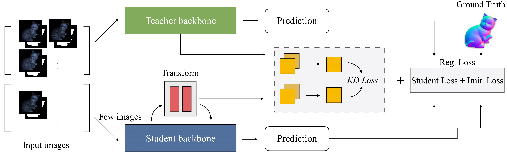

# Minifying Photometric Stereo via Knowledge Distillation-Based Feature Translation



Authors: [Seungoh Han](https://github.com/h5jam), [Jinsun Park](https://github.com/zzangjinsun), and [Donghyeon Cho](https://sites.google.com/view/cnu-cvip)

This is the official implementation of [Minifying Photometric Stereo via Knowledge Distillation-Based Feature Translation](https://opg.optica.org/oe/fulltext.cfm?uri=oe-30-21-38284&id=507592)(Optics Express). 


## Acknowledgement
This code is based on [UPS-GCNet](https://github.com/guanyingc/UPS-GCNet), ECCV20 (Chen et al.).

## Citation
```
@article{han22_pskd,
author = {Seungoh Han and Jinsun Park and Donghyeon Cho},
journal = {Opt. Express},
number = {21},
pages = {38284--38297},
publisher = {Optica Publishing Group},
title = {Minifying photometric stereo via knowledge distillation-based feature translation},
volume = {30},
year = {2022},
}
```
